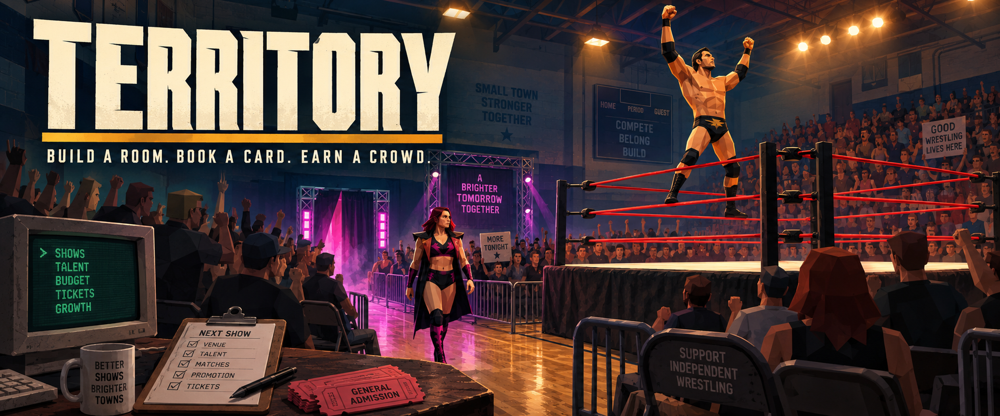
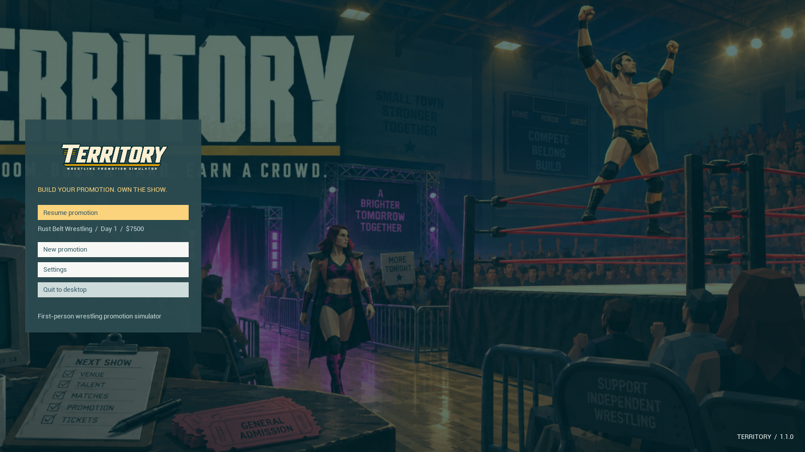

# Territory

Build a room. Book a card. Earn a crowd.

Territory is a first-person wrestling promotion management simulator by DarkHeaven Games. Start as a local booker in a community gym, scout and sign wrestlers, build your venue, book feuds and matches, and produce your own live shows. Grow through larger venues to a basketball arena.

## Download and play

Download **territory-windows-x64-1.1.0.zip** from [the latest release](https://github.com/FennXWeb/Territory/releases/latest), extract the entire ZIP, and run **smog_launch.bat**. The compiled Windows x64 Shipping build includes its runtime files and cooked assets. Unreal Engine, ElevenLabs and Sketchfab accounts are not required to play. Windows 10/11 x64 with a DirectX 12 graphics card is required.

This is an early playable development build. Animations and visuals are stylized and continue to evolve. The header above is illustrated key art.

## Install with SMOG

Add **FennXWeb/Territory** to SMOG, select the Windows ZIP, install, and press Play. The latest published release supplies the game. All five publishing-kit files appear at this repository's root and in the build ZIP:

| File | Format |
| --- | --- |
| smog_icon.ico | Windows icon: 256 px |
| smog_logo.png | Generated transparent title logo, 1200 × 300 |
| smog_header.png | Generated landscape key art, 1600 × 700 |
| smog_meta.xml | Title, description, version, tags, accent and ZIP selection |
| smog_launch.bat | Direct launch that waits for the game |

Saves and settings live in `%LOCALAPPDATA%\FennXWeb\Territory\Saved`, outside SMOG's versioned installation folders. The campaign is `SaveGames\Territory_Campaign.sav` inside that directory. To continue a campaign from the Unreal project, close the game and copy its existing campaign there; back up any destination campaign before replacing it.

## Main menu and settings

Continue your promotion, start a new campaign, adjust settings, or quit from the main menu. Press **Escape** during play to pause the show and open it. Existing campaigns require confirmation before being replaced.

Gameplay settings include mouse sensitivity, inverted look, field of view, and reduced flashing lights. Audio has separate master, music, crowd, announcer, and effects controls with playable previews. Graphics settings include fullscreen/borderless/windowed modes, resolution, quality presets, render scale, vertical sync, and a frame rate cap. Preferences persist separately from campaigns. Display changes revert after 15 seconds unless you confirm them.

Settings previews: [gameplay](Publishing/GameplaySettingsPreview.png), [audio](Publishing/AudioSettingsPreview.png), [graphics](Publishing/GraphicsSettingsPreview.png).

## Playing a show

Use the Territory OS office desktop to buy equipment, manage talent, sign contracts, plan rivalries, book the card, set prices and arrange broadcasting. Skip to the next show for untimed venue prep. Build and adjust the layout, open doors, watch entrances and matches, then finish the day and read feedback at the office.

| Control | Action |
| --- | --- |
| WASD / mouse / Space | Walk / look / jump |
| Escape | Pause menu / settings / back |
| TAB | Management |
| B | Build catalogue |
| Left mouse / drag | Place equipment / create a seating block |
| Q / R / G | Rotate / rotate / grid |
| E / C / right mouse | Move / copy / return or cancel |
| Ctrl+Z / Ctrl+Y | Undo / redo layout edits |
| PageUp / PageDown or Shift+wheel | Raise / lower LED panels |
| F | Change a screen between graphics and live cameras |
| F8 | Start immediately or simulate and skip a segment |

Modular rings, stages, ramps, LED panels, lighting, curtains and backstage rooms support custom layouts. Camera crews follow entrances and matches. Merch and concessions earn additional income. Optimized crowd batches keep background arena fans inexpensive while nearby fans retain interactions. The emergency show advance keeps a cash-strapped promotion able to run another show.

## Publishing files and credits

The header, logo and icon were generated using the built-in imagegen tool. Exact prompts and original PNGs are in [Publishing/artwork-prompts.json](Publishing/artwork-prompts.json) and `Publishing/Artwork`. The supplied [SMOG publishing contract](Publishing/SMOG-PUBLISHING.md), [runtime validation](Publishing/runtime-validation.json), and [archive validation](Publishing/validation.json) are retained here. The ZIP's SHA-256 checksum is attached to the release.

See [THIRD-PARTY-NOTICES.txt](THIRD-PARTY-NOTICES.txt) for model, music, audio and engine credits. This repository distributes the publishing files and compiled releases. Development-source paths in asset notices identify the original development workspace.
